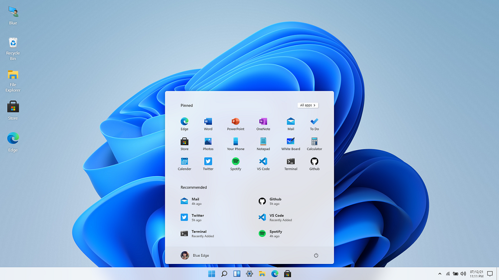
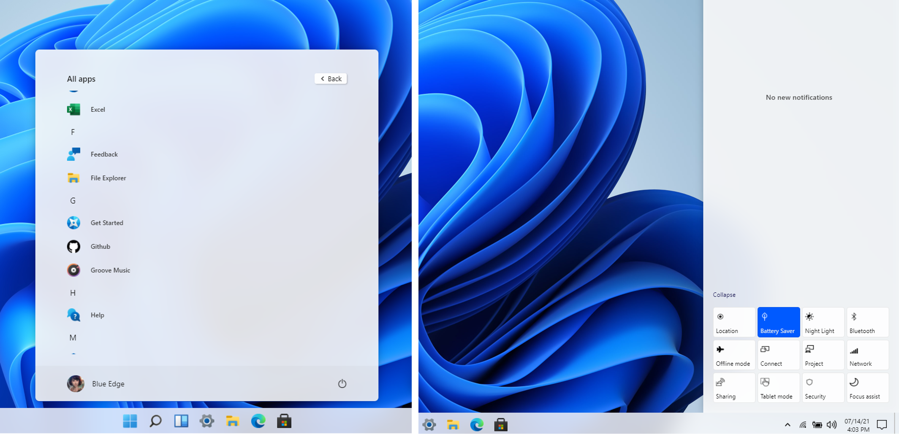
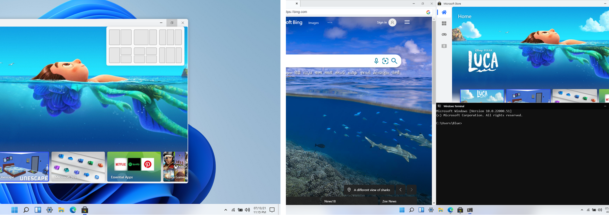
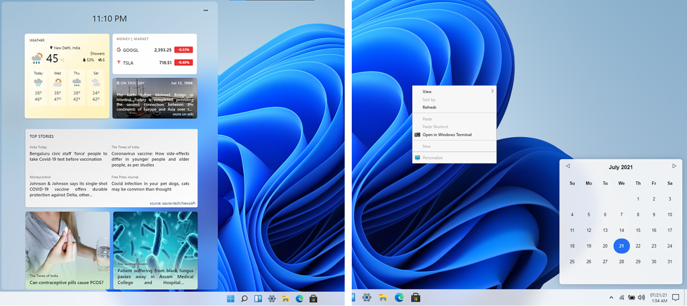

# Windows 11 in React

This open source project is made in the hope to replicate the Windows 11 desktop experience on web, using standard web technologies like React, CSS (SCSS), and Js.
Forked from bluedgetechno/windows11

# Gallery

# Features
- [x] Start Menu, Search Menu and Widgets
- [x] Desktop and Right Click action
- [x] Side Navigation and Calendar View
- [x] Snap windows in different layouts
- [x] Browser, Store, Terminal, Calculator
- [x] Notepad, Vscode, Whiteboard
- [ ] File Explorer + other apps
- [ ] Drag and Resize windows
- [ ] Startup and Lock screen
- [ ] Themes and Background

## Contributors

## License

⚖️ CC0-1.0 License
